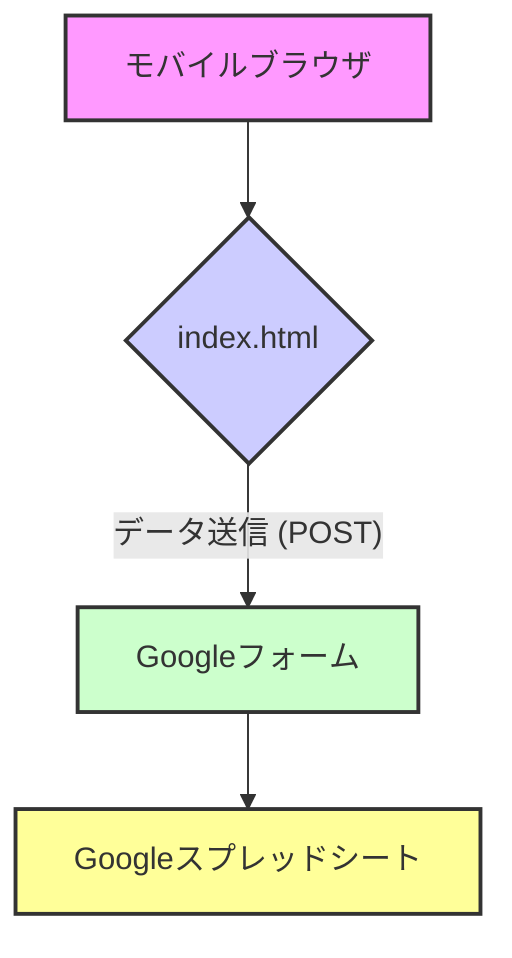

# アーキテクチャ設計

## 1. システム構成図

本システムは、ユーザーが操作するフロントエンドと、Googleフォームを介してGoogleスプレッドシートに直接データを送信するシンプルな構成とする。



| コンポーネント | 説明 | 使用技術 |
| :--- | :--- | :--- |
| **モバイルブラウザ** | ユーザーが直接操作するインターフェース。 | スマートフォン標準ブラウザ |
| **index.html** | データ入力フォーム、バーコードスキャン機能を提供するWebページ。 | HTML, CSS, JavaScript |
| **Googleフォーム** | フォームからのデータを受け取り、スプレッドシートに記録する。 | Googleフォーム |
| **Googleスプレッドシート** | 全ての入力データを記録・管理するデータベース。 | Googleスプレッドシート |

## 2. データフロー

ユーザーによるデータ入力からスプレッドシートへの記録まで、データは以下のように流れる。

1.  **入力 (フロントエンド)**
    1.  ユーザーがブラウザで`index.html`を開き、テキスト情報を入力する。
    2.  バーコードスキャンボタンをクリックし、撮影した画像からバーコードを読み取り、フォームにセットする。
    3.  OCRボタンをクリックし、撮影した画像から文言を読み取り、フォームにセットする。

2.  **データ送信 (フロントエンド → Googleフォーム)**
    1.  「送信」ボタンをクリックすると、HTMLフォームの標準的な`POST`リクエストが実行される。
    2.  フォームの全データが、Googleフォームの`formResponse`エンドポイントに直接送信される。

3.  **データ記録 (Googleフォーム → Googleスプレッドシート)**
    1.  Googleフォームが受信したデータを、連携設定されたGoogleスプレッドシートに自動で追記する。

## 3. フロントエンドの追加仕様

-   **ローカルストレージ:** フォームの入力内容をブラウザの`localStorage`に保存する。ページ読み込み時に`localStorage`からデータを読み込み、フォームに復元する。ユーザーが手動でクリアするか、フォーム送信が成功するまでデータは保持される。

## 4. 技術選定と根拠

-   **フロントエンドライブラリ: QuaggaJS (バーコードスキャン)**
    -   **選定理由:** オープンソースで利用でき、Webベースでのバーコードスキャン実装において広く採用実績があるため。多様なバーコード形式に対応しており、カスタマイズも比較的容易である。
    -   **読み取り方式の変遷と理由:**
        -   当初はライブスキャン方式を採用したが、iOSでのカメラ起動の不安定さや、特定のバーコード形式（アルファベット始まり）の読み取り精度向上のため、静止画撮影方式に変更した。
        -   静止画撮影方式は、ユーザーが最適な状態で撮影できるため、手ブレや環境光の影響を軽減し、より高い読み取り精度が期待できる。
    -   **代替案:** Scandit (高機能だが有償), Dynamsoft (高機能だが有償)。コストを抑え、迅速に開発するためQuaggaJSを選択した。

-   **フロントエンドライブラリ: Tesseract.js (OCR)**
    -   **選定理由:** JavaScriptでクライアントサイドOCRを実現できるオープンソースライブラリであるため。多言語対応しており、手軽に導入できる。
    -   **読み取り方式:** カメラを直接起動し、撮影した画像から文言を読み取る方式を採用。これにより、ユーザーは手軽にOCR機能を利用できる。

## 5. Googleフォーム連携 実装パターン

フロントエンドのHTMLフォームからGoogleフォームへデータを送信し、安全に処理を完了させるための具体的な実装パターンを以下に記す。

### 5.1. Googleフォーム側の設定

1.  **フォームの作成:** Googleフォームで、データを受け取りたい項目（質問）を作成する。
2.  **回答の取得を有効化:** フォームが回答を受け付けられる状態になっていることを確認する。
3.  **事前入力URLの取得:**
    1.  フォーム編集画面の右上メニューから「事前入力したURLを取得」を選択する。
    2.  各入力欄に、後で識別しやすいように仮のデータ（例: `field1`, `field2`）を入力し、「リンクを取得」ボタンを押す。
    3.  取得したURLから、以下の2つの重要情報を抽出する。
        -   **フォームのPOST先URL:** `https://docs.google.com/forms/d/e/.../formResponse`
        -   **各入力項目の`name`属性:** `entry.xxxxxxxxxx`

### 5.2. HTMLの実装

フォームの送信をページ遷移なしで安全に行うため、非表示の`<iframe>`を設置する。

-   `form`タグの`action`属性には、上記で取得した**POST先URL**を指定する。
-   `form`タグの`target`属性には、`<iframe>`の`name`属性（例: `hidden_iframe`）を指定する。
-   各`input`や`textarea`の`name`属性には、上記で取得した**`entry.xxxxxxxxxx`**を正確に設定する。

```html
<!-- Google Form 送信用の非表示iframe -->
<iframe name="hidden_iframe" id="hidden_iframe" style="display:none;" onload="onFormSubmit()"></iframe>

<!-- 入力フォーム -->
<form id="myForm" action="[GoogleフォームのPOST先URL]" method="POST" target="hidden_iframe">
    <label for="field1">項目1</label>
    <input type="text" id="field1" name="entry.123456789">

    <label for="field2">項目2</label>
    <input type="text" id="field2" name="entry.987654321">

    <button type="submit">送信</button>
</form>
```

### 5.3. JavaScriptの実装

フォーム送信の完了を検知し、ユーザーにフィードバックを返すためのJavaScriptを実装する。

-   フォーム送信時にフラグ（`formSubmitted`）を立てる。
-   `<iframe>`の`onload`イベントを捕捉する。このイベントは、Googleフォームへの送信が完了した後に発火する。
-   `onload`イベントハンドラ内でフラグをチェックし、送信完了後の処理（フォームのリセット、完了メッセージの表示など）を実行する。

```javascript
const form = document.getElementById('myForm');
const submitButton = form.querySelector('button[type="submit"]');
let formSubmitted = false;

// フォーム送信時の処理
form.addEventListener('submit', () => {
    submitButton.disabled = true;
    console.log('送信中...');
    formSubmitted = true; // 送信開始のフラグ
});

// iframeのロード完了で呼び出される関数
function onFormSubmit() {
    // フォームが送信された後でのみ処理を実行
    if (formSubmitted) {
        console.log('送信が完了しました！');
        form.reset(); // フォームをリセット
        submitButton.disabled = false;
        formSubmitted = false; // フラグをリセット
    }
}
```

この実装パターンにより、ユーザーはページを離れることなくデータを送信でき、送信失敗によるデータ喪失のリスクを大幅に低減できる。
