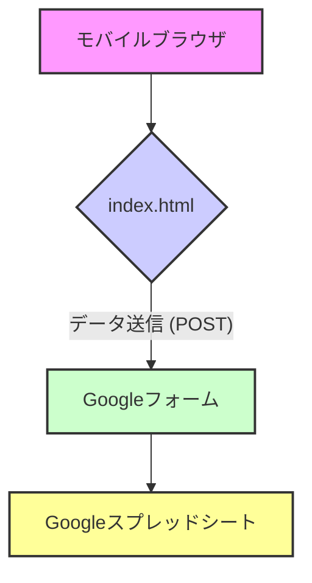

# アーキテクチャ設計

## 1. システム構成図

本システムは、ユーザーが操作するフロントエンドと、Googleフォームを介してGoogleスプレッドシートに直接データを送信するシンプルな構成とする。

| コンポーネント | 説明 | 使用技術 |
| :--- | :--- | :--- |
| **モバイルブラウザ** | ユーザーが直接操作するインターフェース。 | スマートフォン標準ブラウザ |
| **index.html** | データ入力フォーム、バーコードスキャン機能を提供するWebページ。 | HTML, CSS, JavaScript |
| **Googleフォーム** | フォームからのデータを受け取り、スプレッドシートに記録する。 | Googleフォーム |
| **Googleスプレッドシート** | 全ての入力データを記録・管理するデータベース。 | Googleスプレッドシート |

## 2. データフロー

ユーザーによるデータ入力からスプレッドシートへの記録まで、データは以下のように流れる。

1.  **入力 (フロントエンド)**
    1.  ユーザーがブラウザで`index.html`を開き、テキスト情報を入力する。
    2.  バーコードスキャナを起動し、読み取った値をフォームにセットする。

2.  **データ送信 (フロントエンド → Googleフォーム)**
    1.  「送信」ボタンをクリックすると、HTMLフォームの標準的な`POST`リクエストが実行される。
    2.  フォームの全データが、Googleフォームの`formResponse`エンドポイントに直接送信される。

3.  **データ記録 (Googleフォーム → Googleスプレッドシート)**
    1.  Googleフォームが受信したデータを、連携設定されたGoogleスプレッドシートに自動で追記する。

## 3. フロントエンドの追加仕様

-   **ローカルストレージ:** フォームの入力内容をブラウザの`localStorage`に保存する。ページ読み込み時に`localStorage`からデータを読み込み、フォームに復元する。ユーザーが手動でクリアするか、フォーム送信が成功するまでデータは保持される。

## 4. 技術選定と根拠

-   **フロントエンドライブラリ: QuaggaJS**
    -   **選定理由:** オープンソースで利用でき、Webベースでのバーコードスキャン実装において広く採用実績があるため。多様なバーコード形式に対応しており、カスタマイズも比較的容易である。
    -   **代替案:** Scandit (高機能だが有償), Dynamsoft (高機能だが有償)。コストを抑え、迅速に開発するためQuaggaJSを選択した。