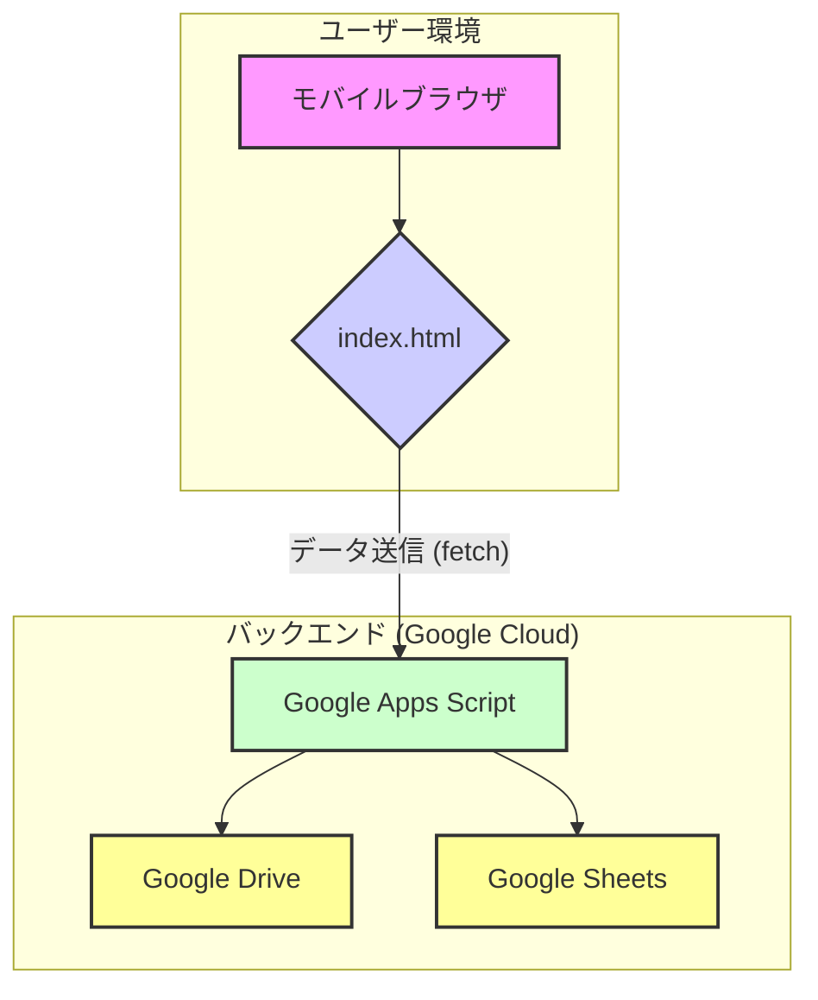

# アーキテクチャ設計

## 1. システム構成図

本システムは、ユーザーが操作するフロントエンドと、データ処理を行うバックエンドで構成される。バックエンドにはGoogleのサービス（Google Apps Script, Google Drive, Google Sheets）を全面的に採用し、サーバーレスアーキテクチャを実現する。

| コンポーネント | 説明 | 使用技術 |
| :--- | :--- | :--- |
| **モバイルブラウザ** | ユーザーが直接操作するインターフェース。 | スマートフォン標準ブラウザ |
| **index.html** | データ入力フォーム、バーコードスキャン、画像選択機能を提供するWebページ。 | HTML, CSS, JavaScript |
| **Google Apps Script (GAS)** | バックエンド処理の中核。Web APIとしてデータを受け取り、他Googleサービスと連携する。 | Google Apps Script |
| **Google Drive** | アップロードされた画像を保存するストレージ。 | Google Drive API |
| **Google Sheets** | 全ての入力データ（画像へのリンクを含む）を記録・管理するデータベース。 | Google Sheets API |

## 2. データフロー

### データ登録 (POSTリクエスト)

ユーザーによるデータ入力からスプレッドシートへの記録まで、データは以下のように流れる。

1.  **入力とエンコード (フロントエンド)**
    1.  ユーザーがブラウザで`index.html`を開き、テキスト情報を入力する。
    2.  「画像を選択」ボタンをタップし、デバイスから画像ファイルを選択する。
    3.  JavaScriptが選択された画像を**Base64形式の文字列**にエンコードする。
    4.  バーコードスキャナを起動し、読み取った値をフォームにセットする。

2.  **データ送信 (フロントエンド)**
    1.  「送信」ボタンをクリックすると、JavaScriptの`fetch` APIが実行される。
    2.  フォームの全データ（Base64文字列を含む）が、JSON形式でGoogle Apps ScriptのWeb APIエンドポイントにPOSTリクエストとして送信される。

3.  **データ受信と処理 (バックエンド)**
    1.  GASの`doPost(e)`関数がリクエストを受け取る。
    2.  リクエストボディからJSONデータを取り出し、パースする。

4.  **画像保存 (バックエンド)**
    1.  JSONデータからBase64文字列を取得する。
    2.  Base64文字列をデコードし、画像データ（Blob）に復元する。
    3.  Google Drive APIを呼び出し、指定のフォルダに画像ファイルを一意のファイル名（例: `タイムスタンプ.jpg`）で作成する。
    4.  保存した画像のURLを取得する。

5.  **データ記録 (バックエンド)**
    1.  Google Sheets APIを呼び出す。
    2.  フォームのテキストデータと、取得した画像のURLを、スプレッドシートの新しい行に追記する。

6.  **レスポンス返却**
    1.  GASは処理の成功または失敗を示すJSONレスポンスをフロントエンドに返す。
    2.  フロントエンドはレスポンスを受け取り、ユーザーに「送信完了」や「エラー」などのメッセージを表示する。

### データ取得 (GETリクエスト)

CD連番の自動採番や簡易データビューワーのため、フロントエンドはGASに対してGETリクエストを送信して情報を取得する。

1.  **リクエスト送信 (フロントエンド)**
    1.  ページの読み込み完了時、または特定のボタンがクリックされた際に、JavaScriptの`fetch` APIが実行される。
    2.  GASのWeb APIエンドポイントに対し、GETリクエストを送信する。リクエストには、取得したいデータの種類を示すパラメータ（例: `?action=getLatestCdNumber` や `?action=getHistory`）を含める。

2.  **データ取得と処理 (バックエンド)**
    1.  GASの`doGet(e)`関数がリクエストを受け取る。
    2.  リクエストパラメータ`e.parameter.action`の値に応じて、実行する処理を分岐する。
    3.  **CD連番取得の場合:** スプレッドシートを開き、CD連番が記録されている列の最終行の値を取得し、それに1を加えた数値を計算する。
    4.  **履歴取得の場合:** スプレッドシートの最終行から数件分のデータを読み取る。

3.  **レスポンス返却 (バックエンド)**
    1.  取得したデータ（次のCD連番、または履歴データの配列）をJSON形式でフロントエンドに返す。

4.  **データ表示 (フロントエンド)**
    1.  フロントエンドはレスポンスを受け取り、JSONデータを解析する。
    2.  取得したCD連番をフォームの入力欄にプレースホルダーとして表示したり、取得した履歴データをHTML要素としてページに描画したりする。

## 3. フロントエンドの追加仕様

-   **状態管理:** アプリケーションの状態（入力データ、履歴データなど）を管理するためのJavaScriptオブジェクトを定義する。
-   **ローカルストレージ:** フォームの入力内容をブラウザの`localStorage`に保存する。ページ読み込み時に`localStorage`からデータを読み込み、フォームに復元する。ユーザーが手動でクリアするか、フォーム送信が成功するまでデータは保持される。
-   **UIコンポーネント:** 履歴データを表示するためのタブやアコーディオンなどのUIコンポーネントをHTMLとCSSで作成する。

## 3. 技術選定と根拠

-   **フロントエンドライブラリ: QuaggaJS**
    -   **選定理由:** オープンソースで利用でき、Webベースでのバーコードスキャン実装において広く採用実績があるため。多様なバーコード形式に対応しており、カスタマイズも比較的容易である。
    -   **代替案:** Scandit (高機能だが有償), Dynamsoft (高機能だが有償)。コストを抑え、迅速に開発するためQuaggaJSを選択した。

-   **バックエンド: Google Apps Script (GAS)**
    -   **選定理由:** Googleサービス（Drive, Sheets）との親和性が極めて高く、追加のサーバーインフラを契約・管理する必要がないため。小〜中規模の利用であれば、無料で運用可能である点も大きなメリットである。
    -   **代替案:** Firebase Functions, AWS Lambda。より高機能でスケーラブルだが、本プロジェクトの要件に対してはオーバースペックであり、セットアップや管理が複雑になるため、GASを選択した。

-   **画像転送方式: Base64エンコーディング**
    -   **選定理由:** 画像データをテキスト情報として扱えるため、他のフォームデータとまとめて単一のHTTPリクエストで送信できる。これにより、フロントエンドとバックエンド間の通信ロジックを簡素化できる。
    -   **代替案:** マルチパートフォームデータ (`multipart/form-data`)。ファイル送信の標準的な方法だが、GASで扱うには一手間必要になる場合がある。Base64はGAS側での処理が比較的シンプルであるため、こちらを選択した。
